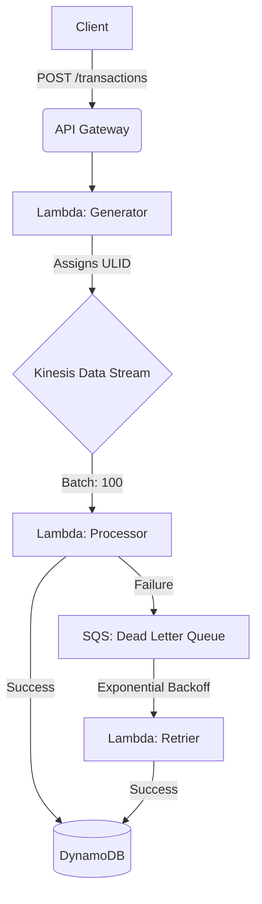

# PayStream Pipeline 🚀

> **Freelance engagement for PayStream Inc.** — A Toronto-based fintech startup processing payments for 800+ merchants across Canada.

## Client Context

| | |
|---|---|
| **Client** | PayStream Inc. — Toronto, ON |
| **Problem** | On Black Friday 2023, direct database writes caused service degradation under peak load, resulting in potential transaction loss and a regulatory incident |
| **Solution** | Event-driven pipeline with guaranteed delivery, resilient retry logic, and zero-downtime design |


---

## Overview

PayStream Pipeline is a serverless, event-driven transaction ingestion system built on AWS. It decouples transaction acceptance from processing, guaranteeing that no payment event is lost — even under extreme load or infrastructure failure.

The system processes thousands of transactions per minute, handles failures automatically through exponential backoff retry logic, and exposes a real-time query API. Every component is defined as Infrastructure as Code and deployable in a single command.

---

## System Architecture



| Component | Role |
|-----------|------|
| **API Gateway** | Synchronous entry point for transaction ingestion |
| **Lambda Generator** | Assigns server-side ULID, publishes to Kinesis |
| **Kinesis Data Stream** | Ordered streaming backbone — decouples ingestion from processing |
| **Lambda Processor** | Reads batches from Kinesis, writes to DynamoDB with idempotency guard |
| **DynamoDB + GSI** | Primary storage with `GSI_ByDate` index for efficient time-range queries |
| **SQS Dead Letter Queue** | Catches failed events — nothing is lost |
| **Lambda Retrier** | Recovers failed events with Exponential Backoff (2s → 4s → 8s → 16s) |

---

## Results

| Metric | Result |
|--------|--------|
| Transactions sent | 5,000 |
| Transactions in DynamoDB | **5,000** |
| Data loss | **0** |
| DLQ messages remaining | **0** |
| Kinesis Stream status | ACTIVE |
| Lambda memory | 256MB |
| Batch size | 100 events |
| Lambda invocations for 5k events | ~50 (vs 500 at batch size 10) |

---

## Tech Stack

| Layer | Technology |
|-------|-----------|
| Runtime | Node.js 20 + TypeScript |
| Infrastructure | AWS CDK (TypeScript) |
| Streaming | AWS Kinesis Data Streams |
| Compute | AWS Lambda |
| Database | AWS DynamoDB (On-Demand + GSI) |
| Resilience | AWS SQS Dead Letter Queue |
| API | AWS API Gateway REST |
| Local simulation | LocalStack Community |
| ID generation | ULID |

---

## Prerequisites

- **Docker** — For LocalStack and Lambda bundling
- **LocalStack** — AWS local cloud emulator (`pip install localstack`)
- **AWS CDK** — Infrastructure as Code (`npm install -g aws-cdk aws-cdk-local`)
- **Node.js 20+** — Core runtime (`nvm install 20`)
- **AWS CLI** — Configured with `test/test` credentials for LocalStack

---

## Operations Guide

### 1. Launch Environment

Start LocalStack and deploy all infrastructure in one command:
```bash
./scripts/localstack-start.sh
./scripts/cdk-deploy.sh
```

This script starts LocalStack in community mode, waits for all services, bootstraps CDK, and deploys the full stack.

### 2. Run Load Test

Simulate 5,000 transactions against the live system:
```bash
./scripts/load-test.sh
```

### 3. Live Dashboard

Monitor the system in real time:
```bash
./scripts/dashboard.sh
```

Shows transaction count, DLQ status, stream health, and latest transactions via GSI query.

### 4. Query the API

Create a transaction:
```bash
curl -X POST http://localhost:4566/restapis/<api-id>/prod/_user_request_/transactions \
  -H "Content-Type: application/json" \
  -d '{"amount": 49.99, "currency": "CAD"}'
```

Get all transactions:
```bash
curl http://localhost:4566/restapis/<api-id>/prod/_user_request_/transactions
```

Get a specific transaction:
```bash
curl http://localhost:4566/restapis/<api-id>/prod/_user_request_/transactions/<transactionId>
```

> [!NOTE]
> Depending on your LocalStack configuration, you might need to use the custom domain format for the endpoints:
> `https://<api-id>.execute-api.localhost.localstack.cloud:4566/prod/transactions`

### 5. Destroy Environment
```bash
cdklocal destroy && localstack stop
```

---

## 📚 Detailed Documentation

- [Architecture Decisions (ADR)](docs/ARCHITECTURE_DECISIONS.md) — Why we chose Kinesis, DynamoDB On-Demand, and ULIDs.
- [Lessons Learned](docs/LESSONS_LEARNED.md) — Troubleshooting log: from Docker bundling to DynamoDB hot partitions.
- [Future Improvements](docs/FUTURE_IMPROVEMENTS.md) — Roadmap from demo to production: auth, observability, and scaling.

---

## Project Structure
paystream-pipeline/
├── lambda/
│   ├── generator/        # Assigns ULID, publishes to Kinesis
│   ├── processor/        # Reads Kinesis, writes to DynamoDB
│   ├── retrier/          # Recovers failed events from DLQ
│   └── query/            # API read layer (GSI-based)
├── lib/
│   └── paystream-pipeline-stack.ts
├── scripts/
│   ├── start-dev.sh
│   ├── load-test.sh
│   └── dashboard.sh
├── docs/
│   ├── ARCHITECTURE_DECISIONS.md
│   ├── LESSONS_LEARNED.md
│   └── FUTURE_IMPROVEMENTS.md
└── .env                  # LocalStack config (not committed)

---

*Built by Santiago — Backend Engineer · NestJS · AWS · TypeScript*
*github.com/peporerto*
