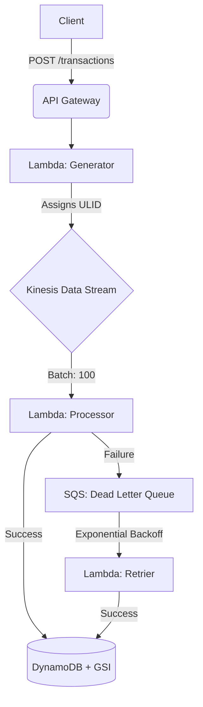

# PayStream Pipeline 🚀

> **Freelance engagement for PayStream Inc.** — A Toronto-based fintech startup processing payments for 800+ merchants across Canada.

---

## The problem

On Black Friday 2023, PayStream's direct database writes caused service degradation under peak load. Transactions were potentially lost. It became a regulatory incident.

The engineering challenge had two layers:

**Layer 1 — Build a pipeline that never loses a payment.** Decouple ingestion from processing. Handle failures automatically. Guarantee delivery even under extreme load.

**Layer 2 — Keep the architecture honest over time.** Document the decisions. Enforce them automatically. Make it impossible to accidentally violate an architectural rule without the system catching it.

Both layers are live.

---

## Results

| Metric | Result |
|--------|--------|
| Transactions sent | 5,000 |
| Transactions in DynamoDB | **5,000** |
| Data loss | **0** |
| DLQ messages remaining | **0** |
| ADR violations caught automatically | ✅ on every PR |

---

## Layer 1 — Event-driven pipeline


```mermaid
graph TD
    A[Client] -->|POST /transactions| B(API Gateway)
    B --> C[Lambda: Generator]
    C -->|Assigns ULID| D{Kinesis Data Stream}
    D -->|Batch: 100| E[Lambda: Processor]
    E -->|Success| F[(DynamoDB + GSI)]
    E -->|Failure| G[SQS: Dead Letter Queue]
    G -->|Exponential Backoff| H[Lambda: Retrier]
    H -->|Success| F
```

| Component | Role |
|-----------|------|
| **API Gateway** | Synchronous entry point — accepts the transaction, returns immediately |
| **Lambda Generator** | Assigns server-side ULID, publishes to Kinesis |
| **Kinesis Data Stream** | Ordered streaming backbone — decouples ingestion from processing |
| **Lambda Processor** | Reads batches from Kinesis, writes to DynamoDB with idempotency guard |
| **DynamoDB + GSI** | Primary storage with `GSI_ByDate` index for efficient time-range queries |
| **SQS Dead Letter Queue** | Catches failed events — nothing is lost |
| **Lambda Retrier** | Recovers failed events with Exponential Backoff (2s → 4s → 8s → 16s) |

Every significant design decision is documented with full rationale and tradeoffs in [`/docs/adrs/`](docs/adrs/).

---

## Layer 2 — ADR governance harness

The pipeline is only as good as the decisions that built it. Layer 2 makes those decisions enforceable.

Every Pull Request triggers an automated review:

```
PR opened
    ↓
GitHub Actions: adr-review.yml
    ↓
init_check.py  — verifies repo state before spending tokens
    ↓
adr_reviewer.py — loads all 7 ADRs as context, reads the diff,
                   calls an LLM via LiteLLM (model-agnostic)
    ↓
Posts structured report as PR comment
    ↓
Critical violations → job fails, merge blocked
Warnings          → comment posted, merge allowed
```

### What it catches

The reviewer detects concrete violations — not style issues, not suggestions. Examples:

```diff
- // ADR-006 violation: Scan instead of GSI query
- const result = await dynamo.send(new ScanCommand({ TableName }));
+ const result = await dynamo.send(new QueryCommand({
+   TableName, IndexName: 'GSI_ByDate',
+   KeyConditionExpression: 'entityType = :t',
+ }));
```

```diff
- // ADR-004 violation: UUID instead of ULID
- const transactionId = uuidv4();
+ const transactionId = ulid();
```

### Reviewer in action

Three scenarios tested and verified:

| Scenario | Code change | Result |
|----------|-------------|--------|
| Obvious violation | `ScanCommand` + `uuidv4` | ❌ Merge blocked — ADR-004, ADR-006 |
| Happy path | Clean `console.log` | ✅ Merge allowed |
| Edge case | Inverted `ConditionExpression` | ❌ Merge blocked — ADR-003 |

### Model-agnostic by design

The reviewer never hardcodes a provider. One environment variable controls the model:

```bash
# Current setup
REVIEW_MODEL=groq/llama-3.3-70b-versatile

# Switch providers without touching code
REVIEW_MODEL=anthropic/claude-haiku-4-5
REVIEW_MODEL=openai/gpt-4o-mini
REVIEW_MODEL=google/gemini-flash-1.5

# Local development, zero API cost
REVIEW_MODEL=ollama/qwen2.5-coder
```

This is [ADR-007](docs/adrs/ADR-007-model-agnostic-ai.md).

### Harness structure

```
PayStream Harness
│
├── GUIDES  (feedforward — shapes agent behavior before it acts)
│   ├── AGENTS.md              ← project constitution, any agent reads this
│   ├── CLAUDE.md              ← Claude Code specific conventions
│   └── docs/adrs/             ← 7 documented architectural decisions
│
└── SENSORS (feedback — verifies behavior after it acts)
    ├── .github/scripts/init_check.py     ← precondition check
    ├── .github/scripts/adr_reviewer.py   ← LLM-based violation detector
    └── .github/workflows/adr-review.yml  ← fires on every PR
```

---

## Architecture Decision Records

All significant decisions are documented with context, rationale, and tradeoffs.

| ADR | Decision | Why it matters |
|-----|----------|----------------|
| [ADR-001](docs/adrs/ADR-001-event-driven-architecture.md) | Event-driven over direct DB writes | The foundational choice — everything else follows from this |
| [ADR-002](docs/adrs/ADR-002-kinesis-over-sqs.md) | Kinesis over SQS | Per-transaction ordering + event replay for compliance |
| [ADR-003](docs/adrs/ADR-003-dynamodb-over-relational.md) | DynamoDB over relational DB | Serverless-native, no connection pool exhaustion |
| [ADR-004](docs/adrs/ADR-004-ulid-over-uuid.md) | ULID over UUID | Chronological sort + prevents client ID injection |
| [ADR-005](docs/adrs/ADR-005-explicit-dlq-strategy.md) | Explicit SQS DLQ | Decoupled retry logic + observable failure path |
| [ADR-006](docs/adrs/ADR-006-gsi-access-pattern.md) | GSI over Scan | Scan at 20M records is catastrophic — this is the fix |
| [ADR-007](docs/adrs/ADR-007-model-agnostic-ai.md) | Model-agnostic via LiteLLM | Vendor lock-in is an architectural risk, not just a preference |

---

## Tech stack

| Layer | Technology |
|-------|-----------|
| Runtime | Node.js 20 + TypeScript |
| Infrastructure | AWS CDK (TypeScript) |
| Streaming | AWS Kinesis Data Streams |
| Compute | AWS Lambda (256MB, batch size 100) |
| Database | AWS DynamoDB (On-Demand + GSI) |
| Resilience | AWS SQS Dead Letter Queue |
| API | AWS API Gateway REST |
| Local simulation | LocalStack Community |
| ID generation | ULID |
| ADR governance | Python + LiteLLM + GitHub Actions |

---

## Running locally

**Prerequisites:** Docker, LocalStack, AWS CDK, Node.js 20+, AWS CLI (`test/test` credentials)

```bash
# 1. Start the environment
./scripts/localstack-start.sh
./scripts/cdk-deploy.sh

# 2. Run the load test (5,000 transactions)
./scripts/load-test.sh

# 3. Live dashboard
./scripts/dashboard.sh

# 4. Destroy
cdklocal destroy && localstack stop
```

**Running the ADR reviewer locally:**

```bash
pip install litellm

# Generate a diff against main
git diff main...your-branch > /tmp/pr.diff

# Run the reviewer
REVIEW_MODEL=ollama/qwen2.5-coder \
  python .github/scripts/adr_reviewer.py --diff /tmp/pr.diff
```

**Setting up GitHub Actions:**

Add these secrets in Settings → Secrets → Actions:

```
REVIEW_MODEL = groq/llama-3.3-70b-versatile
GROQ_API_KEY = your-key
```

---

## Project structure

```
aws-kinesis-reliability-demo/
├── AGENTS.md                          ← harness constitution (any agent reads this)
├── CLAUDE.md                          ← Claude Code conventions
├── docs/
│   └── adrs/                          ← ADR-001 through ADR-007
├── lambda/
│   ├── generator/                     ← ULID assignment + Kinesis publish
│   ├── processor/                     ← Kinesis consumer + DynamoDB write
│   ├── retrier/                       ← DLQ consumer + exponential backoff
│   └── query/                         ← GSI-based read layer
├── lib/
│   └── paystream-pipeline-stack.ts    ← full CDK infrastructure
├── scripts/
│   ├── localstack-start.sh
│   ├── cdk-deploy.sh
│   ├── load-test.sh
│   └── dashboard.sh
├── .github/
│   ├── scripts/
│   │   ├── init_check.py              ← precondition sensor
│   │   └── adr_reviewer.py            ← ADR violation detector
│   └── workflows/
│       └── adr-review.yml             ← fires on every PR
└── test/
    └── paystream-pipeline.test.ts
```

---

## Further reading

- [Architecture Decisions](docs/adrs/) — why we chose Kinesis, DynamoDB On-Demand, ULIDs, and LiteLLM
- [Lessons Learned](docs/LESSONS_LEARNED.md) — troubleshooting log from Docker bundling to DynamoDB hot partitions
- [Future Improvements](docs/FUTURE_IMPROVEMENTS.md) — roadmap from demo to production

---

*Built by Santiago — Backend Engineer · NestJS · AWS · TypeScript*  
*[github.com/peporerto](https://github.com/peporerto)*